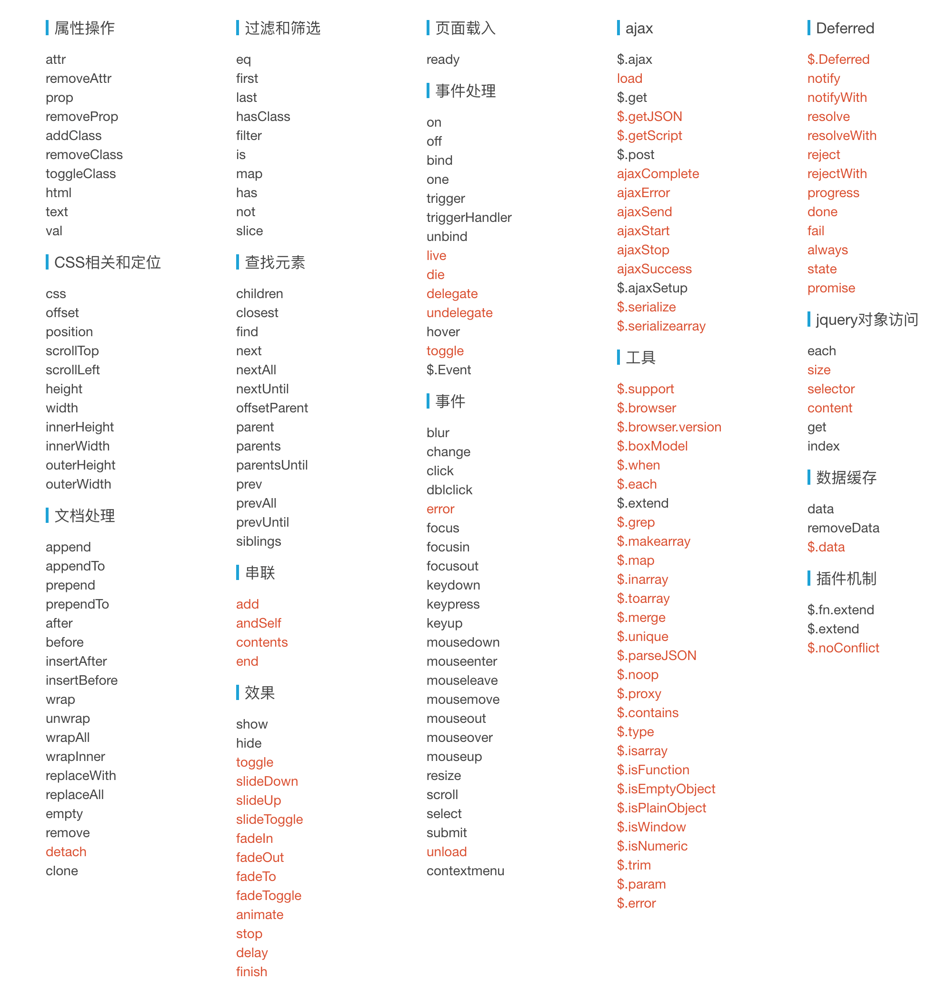

# Xque

## 为什么会开发 Xque

Xque 是为了让 Xhear 有个更小的 `$` 依赖库而设计的；

Xque 是由 es6 开发的兼容 jQuery库，体积更小，只有 10kb （压缩混淆，gzip能更小）；

## 文档

请参考 [jQuery api](https://api.jquery.com)；

具体Xque支持的api如下图，**黑色** 代表 *支持* 这个api，**红色** 代表 *不支持* 这个api；

另外，下面的 api 跟 jQuery 不一样：

[ajax api](doc/ajax.md)