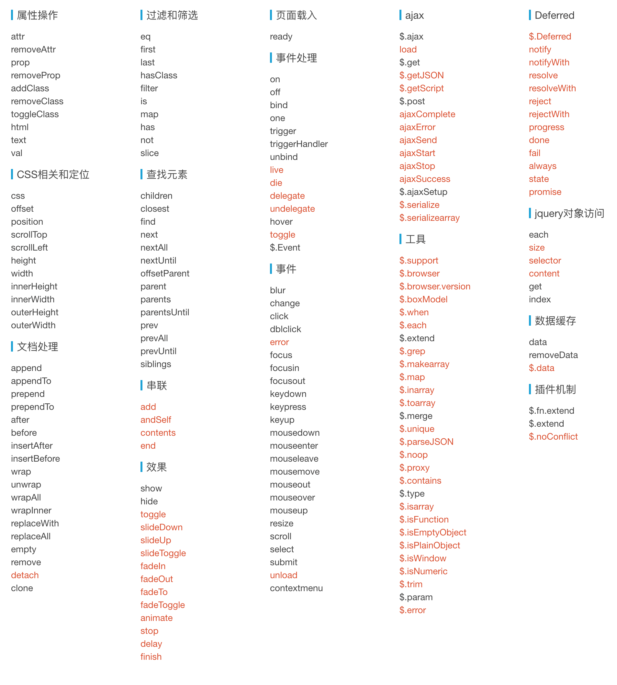

# Xque

## 为什么会开发 Xque

Xque 是为了让 [Xhear](https://github.com/kirakiray/Xhear) 有个更小的 `$` 依赖库而设计的；

Xque 是由 es6 重构的兼容 jQuery库，体积更小，只有 12kb （这是压缩混淆`.min.js`的大小，若果gzip能更小）；

## 定位

大于等于 ES6 的生产环境（或有 [Babel](https://github.com/babel/babel) 脚手架的生成环境）；

取代 [smartJQ](https://github.com/kirakiray/smartJQ) 和 [Zepto](http://zeptojs.com)；

方便大型框架集成更小体积的 `$`(JQuery) API；

## 大小对比

下面的大小是 `压缩混淆` 后的体积；

名字 | 版本 | 大小
--- | --- | ---
Xque.min.js | 1.0.0 | 11.96 kb
[zepto.min.js](http://zeptojs.com/zepto.min.js) | 1.2.0 | 25.76 kb
[jQuery](https://code.jquery.com/jquery-3.3.1.min.js) | 3.3.1 | 84.88 kb

## 文档

请参考 [jQuery api](https://api.jquery.com)；

具体Xque支持的api如下图，**黑色** 代表 *支持* 这个api，**红色** 代表 *不支持* 这个api；

不支持 jQuery 的 `:eq` 等专用选择器写法，支持 `document.querySelectorAll` 的标准CSS选择器;

另外，下面的 api 跟 jQuery 不一样：

[ajax api](doc/ajax.md)

## 原生替换jQuery工具类方法

### `$.extend` 替换方案 

[Object.assign](https://developer.mozilla.org/zh-CN/docs/Web/JavaScript/Reference/Global_Objects/Object/assign) 

### `$.each` 替换方案 

[Object.values](https://developer.mozilla.org/zh-CN/docs/Web/JavaScript/Reference/Global_Objects/Object/values)

[Object.keys](https://developer.mozilla.org/zh-CN/docs/Web/JavaScript/Reference/Global_Objects/Object/keys)

[Array.from](https://developer.mozilla.org/zh-CN/docs/Web/JavaScript/Reference/Global_Objects/Array/from)

[forEach](https://developer.mozilla.org/zh-CN/docs/Web/JavaScript/Reference/Global_Objects/Array/forEach)

### `$.map` 替换方案 

[Array.from](https://developer.mozilla.org/zh-CN/docs/Web/JavaScript/Reference/Global_Objects/Array/from)

[map](https://developer.mozilla.org/zh-CN/docs/Web/JavaScript/Reference/Global_Objects/Array/map)

### `$.grep` 替换方案

[filter](https://developer.mozilla.org/en-US/docs/Web/JavaScript/Reference/Global_Objects/Array/filter)

### `Deferred` 和 `$.when` 替换方案

请使用 ES6 的 Promise 和 ES7 的 `async`和`await`代替

### `$.proxy` 替换方案

[bind](https://developer.mozilla.org/zh-CN/docs/Web/JavaScript/Reference/Global_Objects/Function/bind)

### `$.trim` 替换方案

[trim](https://developer.mozilla.org/zh-CN/docs/Web/JavaScript/Reference/Global_Objects/String/Trim)

### `$.animate`

使用 `CSS animation transition` 或 [Web Animations API](https://developer.mozilla.org/en-US/docs/Web/API/Web_Animations_API) 替代（或相关 polyfill），后期会考虑集成做个更高自定义的 animation 库;

### 后话

觉得缺少什么方法的话，以后会添加进去；